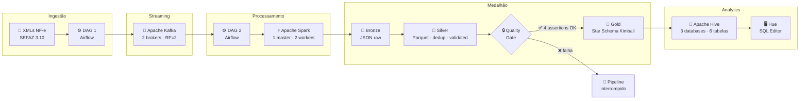
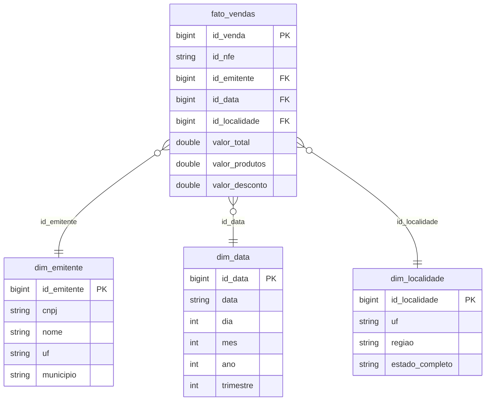
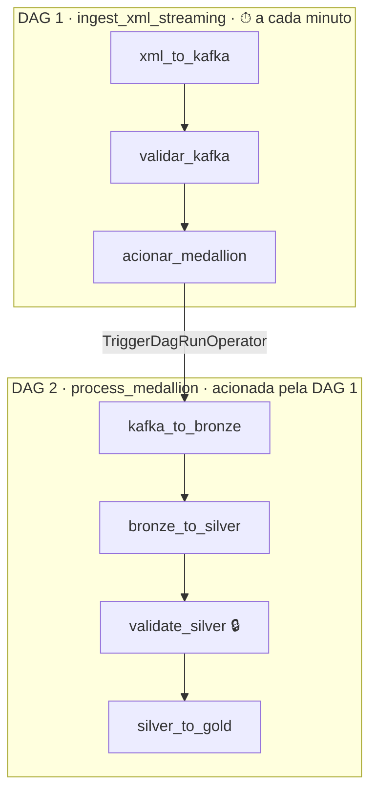

# 🧾 NF-e Streaming Pipeline — Arquitetura Medalhão com Star Schema

<div align="center">


**Pipeline event-driven completo para ingestão, qualidade e análise de Notas Fiscais Eletrônicas (NF-e) no padrão SEFAZ.**

*Desenvolvido como teste técnico para a vaga de Engenheiro de Dados Sênior na **Indra Group / Minsait**.*

</div>

---

## Visão Geral

Este projeto implementa um pipeline de dados de ponta a ponta que processa **100 NF-es (XMLs SEFAZ)** através de uma arquitetura event-driven, aplicando qualidade de dados em cada camada e entregando um **Star Schema analítico** pronto para consultas de negócio.



---

## Arquitetura Medalhão

| | 🥉 Bronze | 🥈 Silver | 🥇 Gold |
|---|---|---|---|
| **Formato** | JSON (raw) | Parquet · Snappy | Parquet · Star Schema |
| **Conteúdo** | Payload completo da NF-e | Campos tipados · deduplicados · validados | Dimensões + Fato (Kimball) |
| **Caminho HDFS** | `/data/bronze/nfe/` | `/data/silver/nfe/` | `/data/gold/{tabela}/` |
| **Tabela Hive** | `bronze.nfe` | `silver.nfe` | `gold.dim_*` · `gold.fato_vendas` |
| **Propósito** | Audit log imutável — reprocessamento sem recoletar do Kafka | Dados confiáveis para análise | Data Warehouse analítico |

### Regras de Qualidade — Camada Silver

| Validação | Regra | Proteção |
|---|---|---|
| Campos obrigatórios | `id_nfe`, `cnpj_emitente`, `valor_total_nf`, `data_emissao` não nulos | Evita NF-es não rastreáveis |
| Deduplicação | `dropDuplicates(["id_nfe"])` | Kafka *at-least-once* pode reenviar a mesma nota |
| Valores monetários | `valor_total > 0`, `valor_produtos > 0`, `valor_desconto >= 0` | Protege agregações financeiras |
| Normalização | `trim()` em campos de texto | Evita duplicatas por espaços invisíveis em JOINs |

### Quality Gate — 4 Assertions antes da Gold

```python
assert total == 100            # volume esperado — detecta perda de eventos
assert duplicatas == 0         # zero duplicatas após deduplicação
assert nulos == 0              # zero campos obrigatórios nulos
assert valores_invalidos == 0  # zero valores monetários corrompidos
```

---

## Modelo Dimensional (Star Schema Kimball)



---

## Orquestração — Apache Airflow



---

## Consultas Analíticas — Camada Gold

Todas as queries rodam no Hive Editor (Hue → http://localhost:8888) sobre as tabelas do Star Schema.

**Faturamento por UF e Região** — *Quais estados geram mais receita?*
```sql
SELECT l.uf, l.regiao,
       COUNT(f.id_nfe)              AS quantidade_nfe,
       ROUND(SUM(f.valor_total), 2) AS faturamento_total,
       ROUND(AVG(f.valor_total), 2) AS ticket_medio
FROM gold.fato_vendas f
JOIN gold.dim_localidade l ON f.id_localidade = l.id_localidade
GROUP BY l.uf, l.regiao
ORDER BY faturamento_total DESC;
```

**Top 10 Emitentes com Participação no Total** — *Quem concentra mais faturamento?*
```sql
SELECT e.cnpj, e.nome, l.uf,
       ROUND(SUM(f.valor_total), 2)                                            AS faturamento_total,
       ROUND(100.0 * SUM(f.valor_total) / SUM(SUM(f.valor_total)) OVER (), 2) AS participacao_pct
FROM gold.fato_vendas f
JOIN gold.dim_emitente   e ON f.id_emitente   = e.id_emitente
JOIN gold.dim_localidade l ON f.id_localidade = l.id_localidade
GROUP BY e.cnpj, e.nome, l.uf
ORDER BY faturamento_total DESC
LIMIT 10;
```

**Evolução Mensal com Crescimento MoM** — *Como o faturamento variou mês a mês?*
```sql
SELECT d.ano, d.mes,
       COUNT(f.id_nfe)              AS quantidade_nfe,
       ROUND(SUM(f.valor_total), 2) AS faturamento_total,
       ROUND(100.0 * (SUM(f.valor_total) - LAG(SUM(f.valor_total)) OVER (ORDER BY d.ano, d.mes))
                   / LAG(SUM(f.valor_total)) OVER (ORDER BY d.ano, d.mes), 2) AS crescimento_pct
FROM gold.fato_vendas f
JOIN gold.dim_data d ON f.id_data = d.id_data
GROUP BY d.ano, d.mes
ORDER BY d.ano, d.mes;
```

---

## Diferenciais Técnicos

| # | Diferencial | Detalhe |
|---|---|---|
| 1 | **42 testes unitários** | 100% mocks — sem Spark, Kafka ou HDFS — roda em < 10s |
| 2 | **Quality Gate** | 4 assertions bloqueiam a Gold se Silver estiver corrompida |
| 3 | **Observabilidade** | `on_failure_callback` e `on_success_callback` em todas as tasks das 2 DAGs |
| 4 | **Star Schema Kimball** | Queries analíticas com window functions (LAG, OVER, Pareto) |
| 4 | **Idempotência** | Pipeline pode ser reexecutado N vezes com resultado idêntico |
| 5 | **Cache estratégico** | `df.cache()` + `unpersist()` — evita rescans desnecessários de HDFS |
| 6 | **Tabelas EXTERNAL** | `DROP TABLE` não apaga dados — Hive é catálogo, HDFS é storage |

---

## Quick Start

```bash
# 1. Subir toda a infraestrutura
docker compose up -d

# 2. Inicializar tabelas no Hive
#    Acesse http://localhost:8888 (admin/admin) → Hive Editor → execute os DDLs abaixo

# 3. Disparar o pipeline
#    Acesse http://localhost:8081 (admin/admin) → DAG: ingest_xml_streaming → Trigger

# 4. Rodar os testes
docker exec pipeline_economia-airflow-1 bash -c \
  "pip install pytest -q && python3 -m pytest /opt/airflow/tests/ -v"
```

### Serviços

| Serviço | URL | Credenciais |
|---|---|---|
| Airflow | http://localhost:8081 | admin / admin |
| Spark Master | http://localhost:8080 | — |
| Hue (HDFS + Hive) | http://localhost:8888 | admin / admin |
| Kafdrop (Kafka UI) | http://localhost:9000 | — |
| HDFS NameNode | http://localhost:50070 | — |

---

## Estrutura do Projeto

```
pipeline_economia/
├── airflow/
│   ├── dags/
│   │   ├── dag_ingest_xml.py          # DAG 1 — XMLs → Kafka
│   │   └── dag_process_medallion.py   # DAG 2 — Kafka → Bronze → Silver → Gold
│   └── scripts/
│       ├── observability.py           # Callbacks de falha/sucesso (compartilhado entre DAGs)
│       ├── ingest_xml_to_kafka.py     # Parser SEFAZ → Kafka
│       ├── kafka_to_bronze.py         # Kafka → HDFS JSON
│       ├── bronze_to_silver.py        # Bronze → Parquet limpo
│       ├── validate_silver.py         # Quality Gate (4 assertions)
│       └── silver_to_gold.py          # Silver → Star Schema
├── engines/
│   └── processing/
│       ├── bronze.py                  # Engine Bronze
│       ├── silver.py                  # Engine Silver (qualidade)
│       └── gold.py                    # Engine Gold (Kimball)
├── tests/                             # 42 testes unitários
├── config/                            # hadoop.env · hue.ini
├── xmls/                              # 100 NF-es fictícias SEFAZ
└── docker-compose.yml                 # 14 serviços
```

---

<div align="center">

Feito por **Luis Felipe Maio Toledo de Carvalho e Silva**

</div>
